# Decisions RPG

- Como concepto, esto parece haber sido una mala.

## Idea

- El jugador tiene n personajes
- Existen varias ciudades a las que el personaje puede viajar
- En las ciudades existen personajes no jugables (NPCs)
- El usuario puede interactuar con los npcs
- Se almacena un registro de las decisiones tomadas por el jugador

> Ejemplo:  
> El personaje llega a una ciudad y hay un gato subido en un arbol, un niño le pide ayuda para bajar al gato.  
>> Ayudar: El gato huye en cuanto toca el suelo.<br>
> No ayudar: El niño intenta trepar al arbol para bajar al gato, pero se termina cayendo y se parte una pierna.  

## Requisitos

El equipo del usuario requiere de la instalación del siguiente software para que el proyecto funcione:

- Git
- Docker
- Java >= 17
- Intellij IDEA o VSC

## Iniciando el proyecto

### Descargar el repositorio

En el terminal escribimos:

``` bash
git clone https://github.com/CarlosRamosDeveloper/Proyecto_Decisiones.git
```

### Preparar el entorno

- Activar el daemon de docker
- Mover decisions_database.sql y docker-compose.yml a la raiz del proyecto

### Levantar el servidor

1. Dirigirse a la ubicación del proyecto.
2. Ejecutar el comando:

``` bash
docker compose up -d
```
3. Importamos la base de datos:

Nota: Es necesario tener el fichero decisions_database.sql y docker-compose.yml en la raiz del proyecto.

``` bash
docker exec -i mysql_db mysql \
-u root -prootPassword decisions_database < decisions_database.sql
```

4. Abrimos el IDE y levantamos el servidor ejecutándolo.

>Nota: Si queremos copiar la base de datos, ejecutaron el comando en el terminal, a la altura del docker-compose.yml
> 
> ``` bash
> docker exec mysql_db mysqldump \
> -u root -prootPassword decisions_database > decisions_database.sql
> ```

## Tables

### character_presets

> Contiene la información de "cuerpo" del personaje.
>> No pueden crearse ni eliminarse por nadie.

| Campo            | Tipo MySQL   | Descripción                   |
|------------------|--------------|-------------------------------|
| id               | bigint       | Identificador del preset.     |
| description      | varchar(255) | Descripción del preset.       |
| race             | varchar(255) | Raza del preset.              |
| sex              | varchar(255) | Sexo del preset.              |
| initial_location | bigint       | Ubicación inicial del preset. |

### decision_options

> Son las opciones que puede elegir un jugador con uno de sus personajes al tomar una decisión. 
>> El usuario no puede crear, modificar ni eliminarlas.<br>
> Solo un administrador puede crear, modificar y eliminar opciones de decisión.

| Campo        | Tipo MySQL   | Descripción                                                                                    |
|--------------|--------------|------------------------------------------------------------------------------------------------|
| id           | bigint       | Identificador de la opción de decisión.                                                        |
| option_key   | varchar(255) | El valor de la decisión. No visible para el usuario.                                           |
| text         | varchar(255) | El texto que aparece en el programa cuando el jugador escoge la opción.                        |
| decision_id  | bigint       | El identificador de la decisión a la que está asociada la opción.                              |
| display_text | varchar(255) | El texto que aparece en el registro cuando se revisan las decisiones tomadas con el personaje. |

### decisions

> Contiene la información de las decisiones que puede tomar el personaje.
>> El usuario no puede crear, modificar ni eliminarlas.<br>
> Solo un administrador puede crear, modificar y eliminar decisiones.

| Campo        | Tipo MySQL   | Descripción                                                  |
|--------------|--------------|--------------------------------------------------------------|
| id           | bigint       | Identificador de la decisión.                                |
| description  | varchar(255) | Texto amigable que muestra la decisión.                      |
| decision_key | varchar(255) | Código textual de la decisión. No es visible para el usuario |

### locations

>Almacena la información de las ubicaciones.
>> No pueden crearse ni eliminarse por nadie.


| Campo       | Tipo MySQL   | Descripción                        |
|-------------|--------------|------------------------------------|
| id          | bigint       | Identificador de la ubicación.     |
| description | varchar(255) | Descripción breve de la ubicación. |
| name        | varchar(255) | Nombre de la ubicación.            |

### npcs

> Los NPCs (personajes no jugables) permiten al usuario interactuar con ellos.
> >> El usuario no puede crear, modificar ni eliminarlas.<br>
> Solo un administrador puede crear, modificar y eliminar npcs.

| Campo       | Tipo MySQL   | Descripción                                                  |
|-------------|--------------|--------------------------------------------------------------|
| id          | bigint       | Identificador del npc.                                       |
| description | varchar(255) | Descripción del npc.                                         |
| name        | varchar(255) | Nombre del npc.                                              |
| location_id | bigint       | Identificador de la ubicación en la que se encuentra el npc. |
| preset_id   | bigint       | Identificador del preset del cuerpo del npc.                 |

### player_characters

>Almacena la información del personaje jugable
>> La clase se llama PlayerCharacter en lugar de Character para evitar problemas relacionados con la clase original de Java

> Es la entidad principal del usuario, ya que es la que interactúa con npcs y a través de la que se toman decisiones.

| Campo            | Tipo MySQL   | Descripción                                                           |
|------------------|--------------|-----------------------------------------------------------------------|
| id               | bigint       | Identificador del personaje                                           |
| name             | varchar(255) | Nombre del personaje                                                  |
| last_location_id | bigint       | Identificador de la última ubicación en la que ha estado el personaje |
| preset_id        | bigint       | Identificador del preset del cuerpo del personaje                     |
| player_id        | bigint       | Identificador del dueño del personaje                                 |

### player_decisions

>Almacena las decisiones que han tomado los personajes.
>> Permite la asignación de decisiones y opciones a personajes

| Campo               | Tipo MySQL  | Descripción                                                             |
|---------------------|-------------|-------------------------------------------------------------------------|
| id                  | bigint      | Identificador de la decisión del personaje.                             |
| created_at          | datetime(6) | Timestamp con la fecha de la asignación de la decisión en el personaje. |
| decision_id         | bigint      | Identificador de la decisión.                                           |
| player_character_id | bigint      | Identificador del personaje.                                            |
| decision_option_id  | bigint      | Identificador de la opción.                                             |

### users

>Almacena la información de los usuarios

| Campo    | Tipo MySQL   | Descripción               |
|----------|--------------|---------------------------|
| id       | bigint       | Identificador del Usuario |
| username | varchar(255) | Nombre de usuario         |
| email    | varchar(255) | email del usuario         |

## Funcionamiento

La aplicación tiene dos tipos de controladores, los controladores para la versión web y los controladores rest.

- La aplicación utiliza docker para levantar los servidores de SpringBoot y MySQL.
- Se realiza un healthcheck en la base de datos para que el servidor se levante automáticamente cuando esté operativa.
- Las entidades se modelan en la carpeta model, siendo la información que se almacena en la base de datos.
- Las interfaces de la carpeta repository permiten implementar JPA con las entidades.
- Los servicios de la carpeta Service implementan los métodos crud de los repositorios
- Para ciertas implementaciones concretas se han creado los servicios usecase, que tienen una dependencia exclusiva y permiten 
reducir el código en los controladores, mejorando su legibilidad y mantenibilidad.
- En la carpeta mapper está ubicado código con funciones externas para permitir el mapeo entre entidades a sus respectivas respuestas.
- Los controladores separan las responsabilidades de Web y API debido a qué web permite un mayor control que la API.
- En la carpeta security está toda la configuración relacionada con los CORS (Ahora en esta versión para desarrollo rápido está únicamente deshabilitandolo)

### Web

>Los controladores "Controller" gestionan las peticiones web, en estos se tienen controles más precisos ya qué son
los endpoints administrativos de la aplicación.
>- Dispone de una página personalizada para los errores 404 y 500.
>- Todas las entidades tienen su error personalizado en caso de no encontrar el id indicado.
>- Las entidades que dependen de otras para ser creadas, no se pueden crear (no aparece el botón de crear), hasta que al menos haya una entidad de la que puedan depender.
>- Pese a que al principio la idea era que funcionase igual que la API (Request -> Model -> Response), debido a problemas con thymeleaf ha quedado una ligera inconsistencia, aunque al usuario no le afecte es un problema a nivel de diseño.
>- Todas las entidades tienen una vista de lista, otra de detalle y otra para formulario, que se utilizan tanto en create como en update.

### API

>Los controladores "RestController" gestionan las peticiones externas, pudiendo ser consumidas por otras webs o aplicaciones. 
>- Las peticiones se reciben mediante objetos Dto de request, que obtienen los datos necesarios para realizar las peticiones. 
>- Cuando la petición llega al servidor, se transforma al tipo de dato de entidad, normalmente a través de un UseCase .
>- Las respuestas del servidor llegan siempre en forma de un Dto de respuesta, para hacer más amigable la información expuesta al usuario.
>- No tiene acceso a los mismos recursos que la versión web.

## Gestión

> Desde el panel de gestión, un administrador del servicio puede administrar la información de la base de datos con facilidad.
> Además de todo lo que puede hacer un usuario común un Administrador del servicio puede:
>- Editar todas las entidades
>- Editar y crear npcs, decisiones y opciones de decisión
>- Eliminar opciones de personaje<br>  
>> El administrador no puede crear ni eliminar ubicaciones ni presets, aunque sí puede modificarlos.

### Dar de alta una nueva decisión

Los pasos para dar de alta una nueva decisión son los siguientes:

1. En el panel de gestión pinchamos en decisiónes. <br> 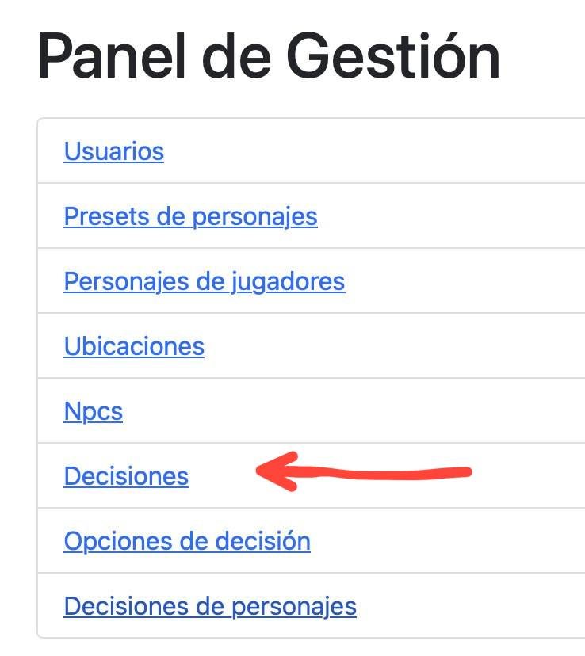
2. Pulsamos el botón de crear, arriba a la izquierda, debajo del título de la sección. <br> 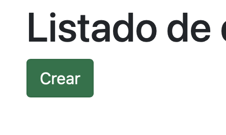
3. Introducimos la key, este dato se almacenará en el atributo decision_key de la decisión y no será visible para el usuario.
4. Introducimos la descripción, este dato se almacenará en el atributo description de la decisión, y sirve para mostrar de forma amigable a qué decisión hace referencia. <br> 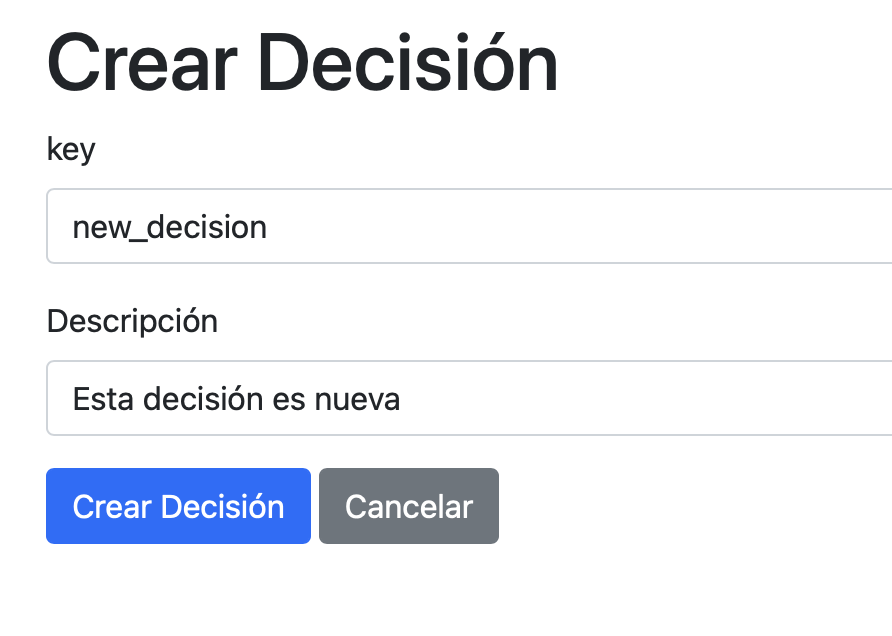
5. Pulsamos en crear decisión.

Ahora mismo tenemos la nueva decisión creada y podemos verla en la lista. <br> 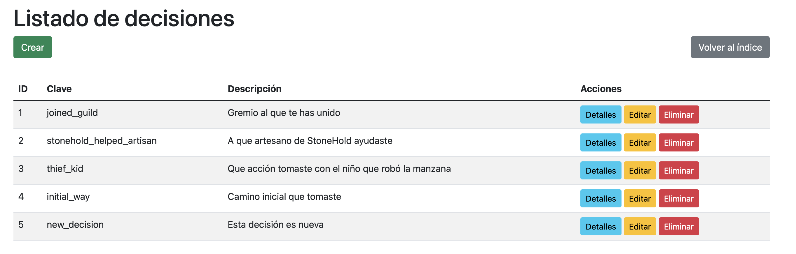 <br>
Al ver sus detalles podemos ver que no tiene opciones asociadas. <br> 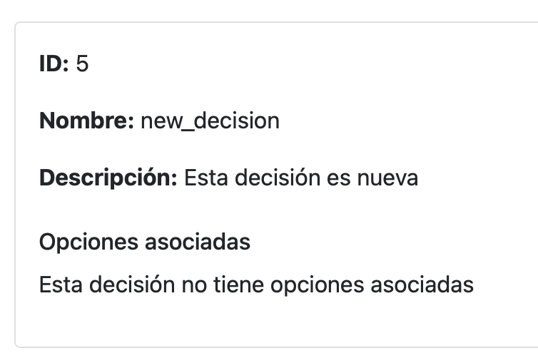

### Dar de alta una nueva opción

Una vez hemos creado la decisión, podemos dar de alta nuevas opciones para la decisión.

1. En el panel de gestión, pinchamos en Opciones de decisión. <br> 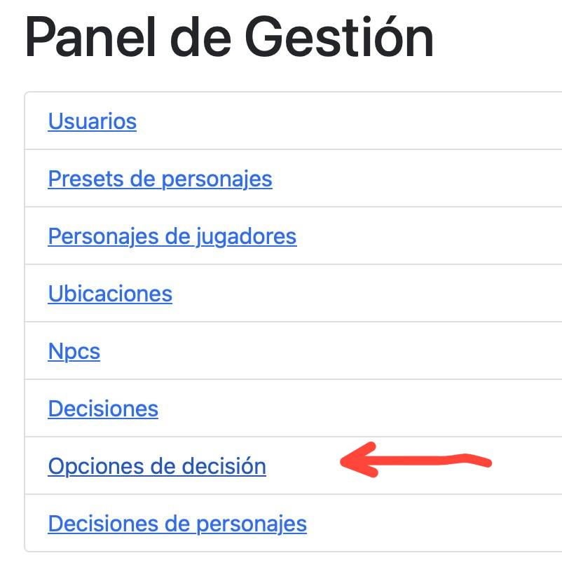
2. Pinchamos en el botón de crear, arriba a la izquierda, debajo del título de la sección. <br> 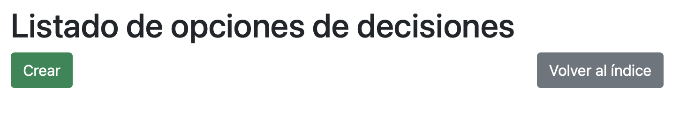
3. Seleccionamos la decisión, esta opción se vinculará a la decisión seleccionada.
4. Introducimos el valor, esto se almacenará la información en el atributo option_key, no es visible para el usuario.
5. Introducimos la etiqueta, esto se almacenará en displayText y es un campo embellecido para el usuario.
6. Introducimos el comentario, este comentario será el texto que le aparece al personaje al tomar la decisión.
7. Pulsamos en crear opción. <br> 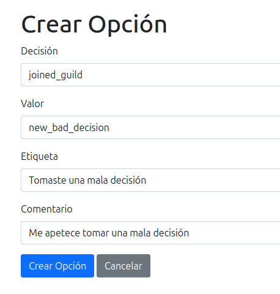

Ahora podemos ver un listado completo de las decisiones. Hemos creado también una buena decisión. <br> 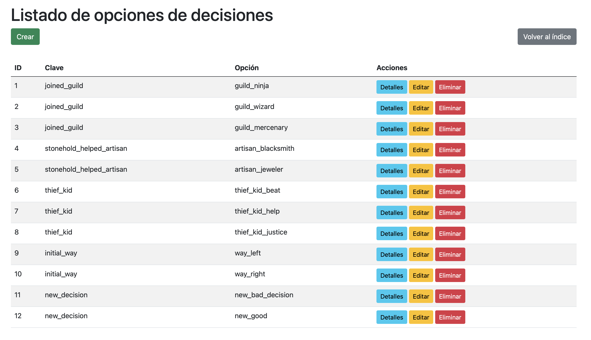

### Asignar una decisión a un personaje

Hasta ahora hemos creado decisiones y opciones para estas, ahora vamos a asignar a un personaje una decisión.<br/>
Para ello pulsamos en el botón de decisiones de personajes. <br> 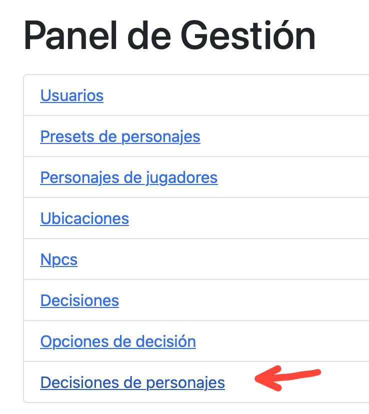 <br>
Recuerda que para poder asignar una decisión a un personaje, primero tiene que haber personajes. <br> 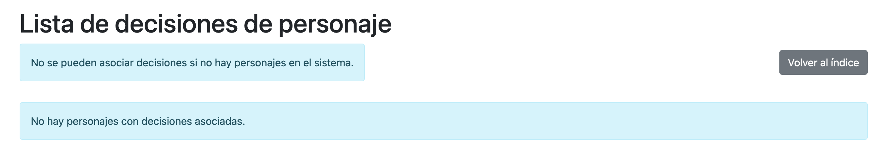
Una vez hay personajes registrados en el sistema el botón aparece con normalidad. <br> 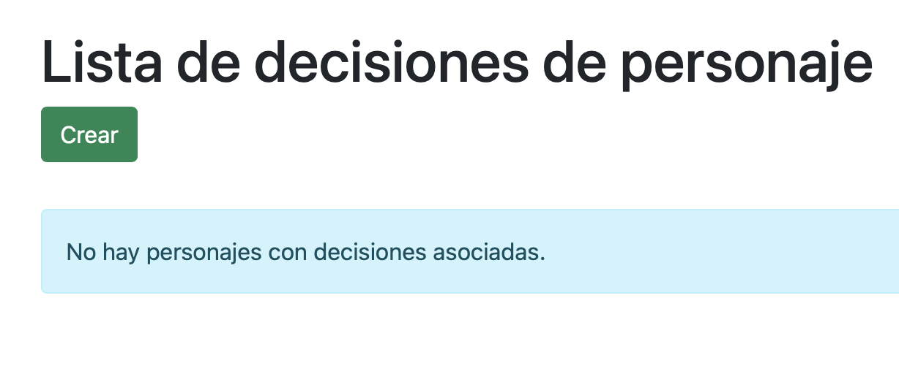
<br>

1. Pulsamos en el botón de crear.
2. Seleccionamos el personaje al que se va a asignar la decisión.
3. Seleccionamos la decisión que se va a asociar al personaje.
4. Seleccionamos la elección que se va a asociar al personaje. Es importante asegurarse de que la elección esté relacionada con la decisión, ya que thymeleaf no permite la carga reactiva de la página.
5. Pulsamos en asignar decisión al personaje. <br> 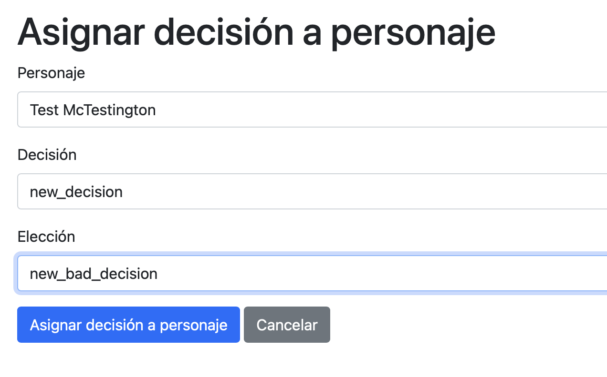

Ahora podemos ver el resultado de la creación. <br> 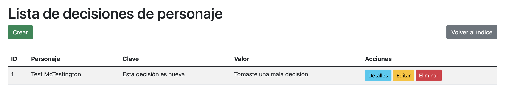
Si pulsamos en detalle, podemos ver la información detallada. <br> 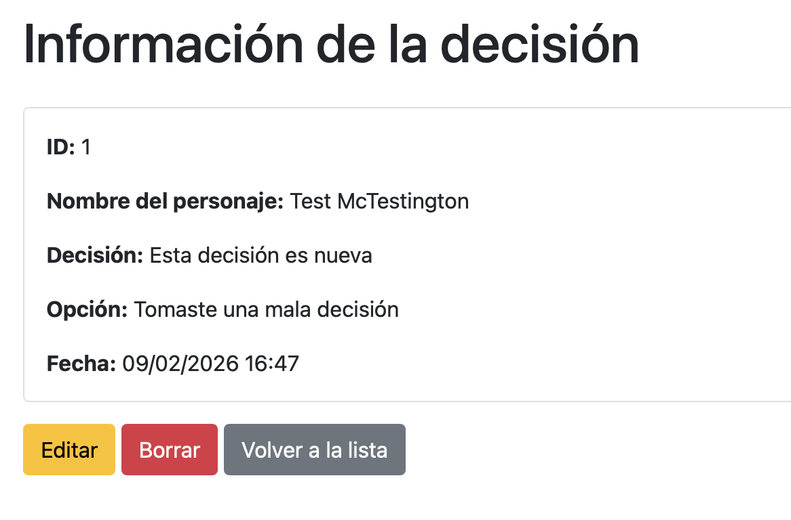

### Edición

Como nos arrepentimos de haberle asignado una mala decisión al personaje, pulsamos en el botón de edición, debajo de los datos.
En esta pantalla podemos modificar todos los datos que consideremos necesarios de la entidad.
Vamos a pulsar en la elección y la cambiamos por una buena decisión, tras eso, pulsamos modificar decisión del personaje. <br> 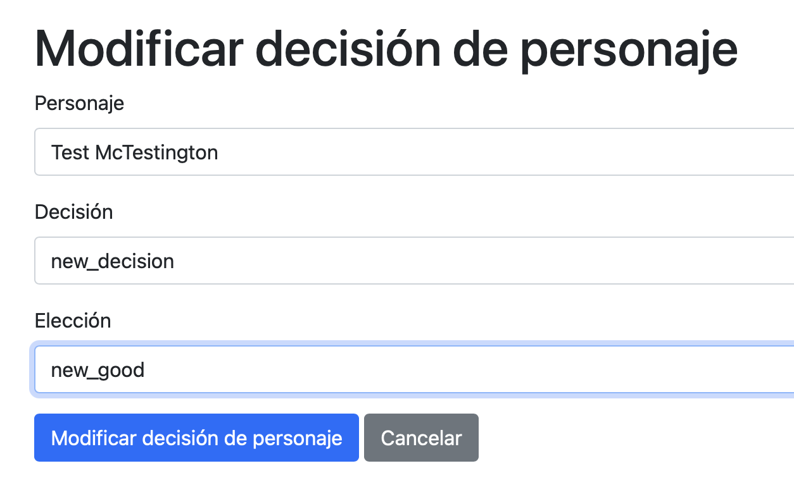 <br>
Al volver al listado, podemos ver que los cambios se han almacenado correctamente. <br> 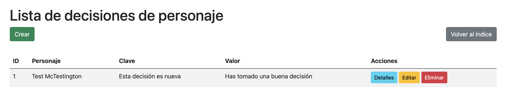
Para comprobar que todo está correcto, volvemos a pulsar en detalle. Podemos apreciar de que todo se ha actualizado correctamente. <br> 

## Endpoints

> Este es el listado de todos los endpoints REST del servidor.

### User

>La API expone en el endpoint /api/users la información para los clientes relacionada con los usuarios. 
> Estos son métodos http y los endpoints expuestos por la API

| HTTP method | Endpoint                                             | Resultado                                  |
|-------------|------------------------------------------------------|--------------------------------------------|
| Post        | localhost:8080/api/users                             | Crea un usuario                            |
| Get         | localhost:8080/api/users                             | Obtiene todos los usuarios                 |
| Get         | localhost:8080/api/users/1                           | Obtiene el usuario con el id 1             |
| Get         | localhost:8080/api/users/email?email=carlos@mail.com | Obtiene el usuario por email               |
| Put         | localhost:8080/api/users/1                           | Actualiza los valores del usuario con id 1 |
| Delete      | localhost:8080/api/users/3                           | Elimina al usuario con id 3                |

>Ejemplo del body de crear / actualiozar usuario 
> ``` Json 
> {
>   "username": String,
>   "email": String,
> }
> ```

>Ejemplo de respuesta de usuario
> ``` json
> { 
>   "id": Long,
>   "username": String,
>   "email": String,
>   "characters": [
>       {
>           "id": Long,
>           "user": String,
>           "name": String,
>           "location": String,
>           "race": String,
>           "sex": String
>       }
>   ]
> }
> ```

### Location

> La API expone en el endpoint /api/locations la información para los clientes relacionada con 
> las ubicaciones del juego. Estos son métodos http y los endpoints expuestos por la API

| HTTP method | Endpoint                       | Resultado                        |
|-------------|--------------------------------|----------------------------------|
| Get         | localhost:8080/api/locations   | Obtiene todas las ubicaciones    |
| Get         | localhost:8080/api/locations/1 | Obtiene la ubicación con el id 1 |

>Ejemplo de respuesta de ubicación
> ``` json
> {
>   "id": Long,
>   "name": String,
>   "description": String,
>   "npcs": [
>       {
>           "id": Long,
>           "name": String,
>           "race": String,
>           "sex": String,
>           "description": String,
>           "location": String
>       }
>    ]
> }
> ```

### Preset

>La api expone en el endpoint /api/presets la información para los clientes relacionada con los presets
> del juego. Estos son métodos http y los endpoints expuestos por la API

| HTTP method | Endpoint                     | Resultado                         |
|-------------|------------------------------|-----------------------------------|
| Get         | localhost:8080/api/presets   | Obtiene todos los presets         |
| Get         | localhost:8080/api/presets/1 | Obtiene la ubicación del preset 1 |

>Ejemplo de respuesta de preset
> ``` json
> {
>    "id": Long,
>    "race": String,
>    "sex": String,
>    "location": String,
>    "description": String
> }
> ```

### Character

> La api expone en el endpoint /api/characters la información para los clientes relacionada con los personajes
> del juego. Estos son métodos http y los endpoints expuestos por la API

| HTTP method | Endpoint                                 | Resultado                                    |
|-------------|------------------------------------------|----------------------------------------------|
| Post        | localhost:8080/api/characters            | Permite crear un nuevo personaje             |
| Get         | localhost:8080/api/characters            | Obtiene todos los personajes                 |
| Get         | localhost:8080/api/characters/1          | Obtiene la información del personaje 1       |
| Get         | localhost:8080/api/characters/by-user/3  | Obtiene todos los personajes del usuario 3   |
| Patch       | localhost:8080/api/characters/1          | Permite cambiar el nombre del personaje 1    |
| Patch       | localhost:8080/api/characters/1/location | Permite cambiar la ubicación del personaje 1 |
| Delete      | localhost:8080/api/characters/1          | Elimina al personaje 1                       |

>Ejemplo del body de crear un personaje
> ``` Json 
> {
>   "userId": Long,
>   "presetId": Long,
>   "name": String,
> }
> ```

>Ejemplo del body de cambiar el nombre de un personaje
> ``` Json 
> {
>   "name": String,
> }
> ```

>Ejemplo del body de cambiar la ubicación de un personaje
> ``` Json 
> {
>   "locationId": Long,
> }
> ```

>Ejemplo de respuesta de personaje
> ``` json
> {
>   "id": Long,
>   "user": String,
>   "name": String,
>   "location": String,
>   "race": String,
>   "sex": String
> }
> ```

### Npc

> La api expone en el endpoint /api/npcs la información para los clientes relacionada con los 
> personajes no jugables del juego. Estos son métodos http y los endpoints expuestos por la API

| HTTP method | Endpoint                  | Resultado                        |
|-------------|---------------------------|----------------------------------|
| Get         | localhost:8080/api/npcs   | Obtiene todos los npcs           |
| Get         | localhost:8080/api/npcs/1 | Obtiene la información del npc 1 |

>Ejemplo de respuesta de npc
> ``` json
> {
>   "id": Long,
>   "name": String,
>   "race": String,
>   "sex": String,
>   "description": String,
>   "location": String
> }
> ```

### Decision

> La api expone en el endpoint /api/decisions la información para los clientes relacionada con los
> las decisiones que pueden tomar los personajes en el juego. Estos son métodos http y los endpoints expuestos por la API

| HTTP method | Endpoint                       | Resultado                               |
|-------------|--------------------------------|-----------------------------------------|
| Get         | localhost:8080/api/decisions   | Obtiene todas las decisiones            |
| Get         | localhost:8080/api/decisions/1 | Obtiene la información de la decisión 1 |

>Ejemplo de respuesta de decisión
> ``` json
> {
>   "id": Long,
>   "key": String,
>   "description": String,
>   "options": [
>     {
>       "id": Long,
>       "decisionId": Long,
>       "decision": String,
>       "value": String,
>       "displayText": String,
>       "text": String
>     },
>   ]
> }
> ```

### DecisionOption

> La api expone en el endpoint /api/decisionOptions la información para los clientes relacionada con las
> respuestas que puede elegir el personaje en el juego. Estos son métodos http y los endpoints expuestos por la API

| HTTP method | Endpoint                             | Resultado                                |
|-------------|--------------------------------------|------------------------------------------|
| Get         | localhost:8080/api/decisionOptions   | Obtiene todas las opciones de decisiones |
| Get         | localhost:8080/api/decisionOptions/1 | Obtiene la información de la opción 1    |

>Ejemplo de respuesta de una opción
> ``` json
> {
>   "id": Long,
>   "decisionId": Long,
>   "decision": String,
>   "value": String,
>   "displayText": String,
>   "text": String
> },
> ```

### CharacterDecision

> La api expone en el endpoint /api/playerDecisions la información para los clientes relacionada con los
> las decisiones que ha tomado un personaje en el juego. Estos son métodos http y los endpoints expuestos por la API

| HTTP method | Endpoint                             | Resultado                                                     |
|-------------|--------------------------------------|---------------------------------------------------------------|
| Post        | localhost:8080/api/playerDecisions   | Obtiene la información de la opción 1                         |
| Get         | localhost:8080/api/playerDecisions   | Permite asignar una nueva decisión y su elección al personaje |
| Get         | localhost:8080/api/playerDecisions/1 | Obtiene la información de la opción 1                         |

>Ejemplo del body de asignar una decisión y una opción a un personaje
> ``` Json 
> {
>   "characterId": Long,
>   "decisionId": Long,
>   "optionId": Long
> }
> ```

>Ejemplo de respuesta de una decisión de personaje
> ``` json
> {
>   "id": Long,
>   "characterName": String,
>   "decision": String,
>   "option": String,
>   "createdAt": LocalDate
> },
> ```